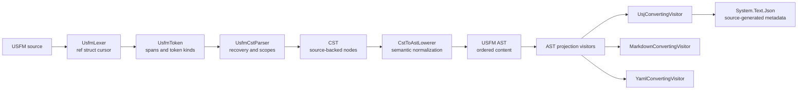
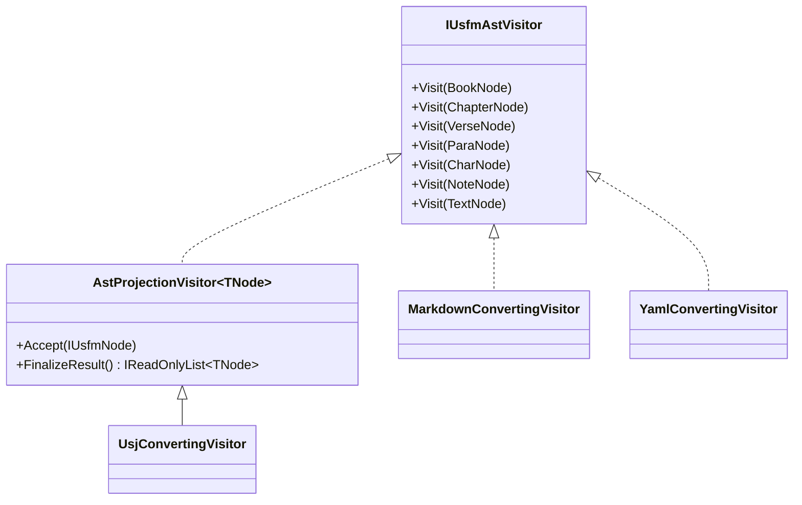
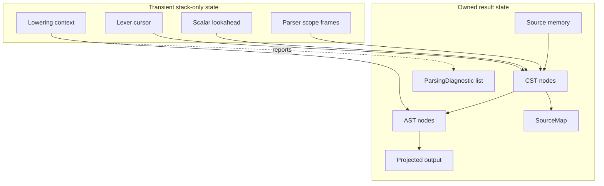

# USFM Architecture

The .NET pipeline follows the staged design of [`jcuenod/usfm3`](https://github.com/jcuenod/usfm3):

```text
tokenize -> parse CST -> lower AST -> project output -> serialize
```

Each stage removes information that the next stage should not need to reason about. Concrete syntax is preserved in the CST; semantic structure is created by the lowerer; output rules belong to projection visitors.

## Pipeline



The public facade is [Usfm.cs](../dotnet/USFM/Parsers/Usfm.cs) and [UsfmConverter.cs](../dotnet/USFM/Parsers/UsfmConverter.cs): `ParseCst`, `ParseAst`, `ParseUsj`, and stream conversion APIs. A [UsfmParseResult](../dotnet/USFM/Parsers/UsfmParseResult.cs) owns the source, CST, AST, diagnostics, and source map for callers that need the complete result.

## Layer Ownership

### Lexer

[UsfmLexer](../dotnet/USFM/Lexers/UsfmLexer.cs) is a stack-only cursor over `ReadOnlySpan<char>`.

- Emits typed tokens with UTF-16 source offsets.
- Uses `SearchValues<char>` for delimiter searches.
- Supports text, markers, closing markers, attributes, and standalone milestones.
- Uses scalar lookahead state; a `ref struct` token never enters a heap object.
- Does not infer paragraphs, notes, or semantic attributes.

### CST

[UsfmCstParser](../dotnet/USFM/Parsers/UsfmCstParser.cs) owns concrete structure and recovery.

- Retains source-backed `ReadOnlyMemory<char>` slices.
- Preserves marker names, delimiters, whitespace, pipes, quoted values, and unknown syntax.
- Records mismatched-marker diagnostics without throwing.
- Tracks implicit scopes for paragraphs, verses, tables, cells, and inline markers.
- Produces [CstNode](../dotnet/USFM/Parsers/CstNode.cs) records that can be reconstructed from [SourceSpan](../dotnet/USFM/Parsers/SourceSpan.cs).

The CST may allocate its owned node collections. Only transient lexer/parser state is required to be stack-only.

### AST

[CstToAstLowerer](../dotnet/USFM/Parsers/CstToAstLowerer.cs) converts concrete syntax into semantic USFM nodes.

- Normalizes verse ranges into `StartVerse` and `EndVerse`.
- Converts quoted and shorthand attributes into semantic attributes.
- Converts common character, note, paragraph, table, row, and cell markers.
- Groups table rows and cells into semantic containers.
- Removes line-ending-only CST trivia while retaining meaningful verse separators.
- Keeps output-specific rules out of parsing.

AST nodes are owned objects. They may allocate lists and strings because they represent the semantic document rather than a transient scan.

### Projection Visitors

Projection is a visitor operation over the AST, not another parser.



Visitors own only output concerns:

- USJ owns `type`, `sid`, `vid`, content, extension properties, and JSON shape.
- Markdown owns headings, inline formatting, links, and footnote rendering.
- YAML owns the YAML representation and indentation.

They consume AST nodes and never tokenize or recover USFM.

## Memory and Diagnostics



Rules:

- `ReadOnlySpan<char>` and `ref struct` values never cross an async, task, iterator, class, or collection boundary.
- CST nodes point into the owned source memory instead of copying every token value.
- `SourceMap` and diagnostics are parallel metadata owned by the parse result.
- .NET offsets are UTF-16 character offsets, matching `ReadOnlyMemory<char>`.
- Diagnostic codes should remain stable even when diagnostic messages improve.
- Source text, scripture content, and attribute values are never attached to tracing tags.

## Observability

[Usfm](../dotnet/USFM/Parsers/Usfm.cs) exposes an `ActivitySource` named `USFM`. Public stages use these activity names:

```text
usfm.parse-cst
usfm.parse-ast
usfm.project-usj
```

Activities are optional and cheap when no listener is installed. The library does not subscribe or export telemetry. Useful tags are source length, diagnostic count, AST node count, and output format.

## Performance Boundaries

The lexer and CST parser are the hot path:

- No `string.Split`, `Substring`, regular expressions, or per-token string materialization.
- Delimiter searches use span APIs and `SearchValues<char>` where the search set is stable.
- Parser frames store offsets, marker kinds, and child ranges rather than `UsfmToken` values.
- Owned allocations are concentrated in the returned CST, AST, diagnostics, and output models.
- Async stream APIs materialize owned source text before crossing the iterator boundary; a future event-stream API can expose owned token data for true incremental processing.

## Validation

Layer-specific tests in `dotnet/USFM.Tests` should remain small and ownership-focused:

| Module | High-value test cases |
| --- | --- |
| `UsfmLexer` | Text and marker boundaries; closing markers; pipes; standalone milestones; CRLF and LF; Unicode offsets; EOF; lookahead does not duplicate or lose a token. |
| `UsfmCstParser` | Nested markers; implicit paragraph/verse scopes; mismatched and unterminated markers; unknown markers; malformed attributes; exact source-span reconstruction. |
| `SourceMap` | Root and child mappings; stable node IDs; UTF-16 offsets around surrogate pairs; every mapped span stays within the source. |
| Diagnostics | Stable code and severity; source span; document order; recovery continues after an error; no exception for malformed input. |
| `CstToAstLowerer` | Verse ranges; quoted and shorthand attributes; duplicate/order-preserving CST attributes; milestone start/end scopes; notes; tables; unknown-marker policy; trivia normalization. |
| AST visitors | Every AST node dispatches exactly once; nested content is visited in order; projection context resets between documents; unsupported nodes fail clearly. |
| USJ projection | `type`, `sid`, `vid`, content, extension attributes, milestones, notes, tables, and source-generated JSON round trips. |
| Markdown/YAML projection | Headings, inline markers, links, footnotes, tables, escaping, empty content, and repeated projections do not leak state. |
| `UsfmReader`/facade | Stream ownership; cancellation; empty input; diagnostics are returned; CST-only calls do not lower AST; AST-only calls do not serialize JSON. |
| Fixture parity | Every `samples/*/proposed.json` fixture; normalized AST comparison; malformed fixture recovery; allocation and throughput baselines for lexer/CST. |

The current focused tests cover CST spans, recovery diagnostics, duplicate attributes, source maps, verse ranges, and attribute lowering. Add a test at the lowest layer that owns a new rule; do not test parser behavior indirectly through JSON when a CST or AST assertion is sufficient.

Run the solution build with:

```sh
dotnet build ./dotnet/USJ.sln
```

The remaining golden-output differences are output-semantics work in AST lowering and projection rules, not a second parser implementation. New behavior should be added to CST or AST contract tests before changing a projection visitor.
