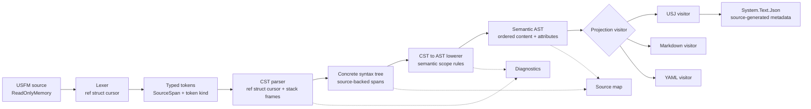
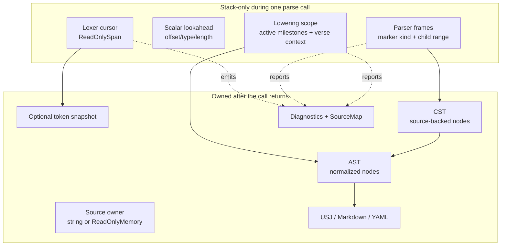
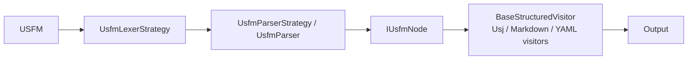
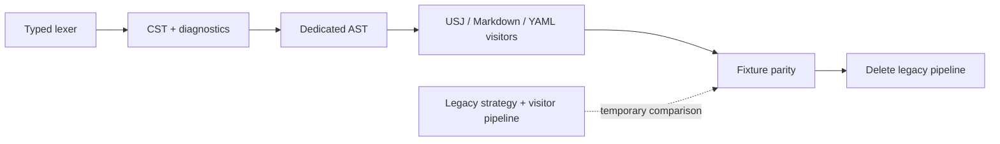

# USFM Parsing Architecture

This document defines the target .NET architecture for `nice-usfm-json`. It follows the staged design of [`dsc-faithtech/usfm3`](https://github.com/dsc-faithtech/usfm3):

```text
tokenize -> parse CST -> lower AST -> project output -> serialize
```

The central rule is that every layer simplifies the representation for the next layer. A layer must not make a later layer rediscover information that the earlier layer already owned.

## Design Principles

- The lexer identifies tokens and source locations. It does not infer USFM structure.
- The CST preserves concrete syntax, trivia, malformed input, and exact source spans.
- The AST contains semantic structure only. It does not carry CST trivia.
- Source maps and diagnostics travel beside the trees rather than being hidden in nodes.
- Output formats are visitors over the AST. USJ, Markdown, and YAML do not parse USFM.
- Lower layers use stack-only state wherever a value does not need to escape the current parse operation.
- Public APIs return owned results. `ReadOnlySpan<char>` and `ref struct` values never cross an async or heap boundary.

## Pipeline



The dotted channels are metadata, not additional parsing stages. Diagnostics are collected during recovery and lowering. Source maps connect semantic nodes to their concrete source spans without putting formatting trivia in the AST.

## Layer Contracts

### 1. Lexer

`UsfmLexer` is a stack-only cursor over `ReadOnlySpan<char>`.

Responsibilities:

- Recognize marker starts, marker ends, text, attribute pipes, and milestone delimiters.
- Return typed `UsfmToken` values containing source-relative offsets and spans.
- Use `SearchValues<char>` for delimiter and whitespace searches.
- Maintain at most scalar lookahead state. Pending tokens must be represented by offsets and lengths, never by a stored `ref struct`.
- Avoid `Split`, `Substring`, regular expressions, and per-token string creation.

Non-responsibilities:

- Paragraph or note structure
- Implicit scope closure
- Attribute dictionaries
- AST node creation
- Semantic validation

The lexer may report lexical diagnostics through the parse session, but it must continue recovering when a malformed marker does not prevent progress.

### 2. CST Parser

`UsfmCstParser` consumes lexer tokens and uses stack-only parser state for the active operation. Heap allocation is allowed for the resulting owned CST because the CST outlives parsing; transient frames and token values must not retain `ref struct` instances.

Responsibilities:

- Preserve marker delimiters, pipes, whitespace, quoted values, unknown markers, and malformed closures.
- Build source-backed nodes using `ReadOnlyMemory<char>` and `SourceSpan`.
- Preserve ordered and duplicate attributes.
- Recover from mismatched and unclosed markers by emitting diagnostics and retaining the input.
- Produce a CST that can reconstruct the original source exactly.

The CST is intentionally verbose. Its job is fidelity, not convenience.

### 3. Source Map and Diagnostics

Source maps and diagnostics are owned by `UsfmParseResult`, not by mutable parser instances.

The .NET implementation uses UTF-16 character offsets because the source API is based on `ReadOnlyMemory<char>`. If byte offsets are needed for external tooling, they are derived explicitly at the boundary.

Recommended diagnostic shape:

```csharp
public readonly record struct ParsingDiagnostic(
    string Code,
    DiagnosticLevel Level,
    string Message,
    SourceSpan Span);
```

Diagnostics should be stable, sortable by source position, and testable without matching human prose. Examples include `USFM001` for an unknown closing marker and `USFM002` for an unterminated marker.

### 4. Semantic AST

The lowerer converts CST into dedicated semantic AST models. The AST must not depend on `USFM.Visitors` or parser implementation types.

The lowerer owns:

- Implicit paragraph and inline scope rules
- Verse range normalization into `StartVerse` and `EndVerse`
- Active milestone scopes across verse boundaries
- Notes, character markers, tables, rows, and cells
- Ordered attributes and unknown-marker policy
- Source-map node identifiers

The AST should contain normalized content and semantic attributes, but not source whitespace or delimiter spelling.

### 5. Projection Visitors

USJ, Markdown, and YAML are independent visitors over the semantic AST:

```mermaid
classDiagram
    class UsfmAstNode {
        +Accept(visitor, context)
    }
    class IAstVisitor~TResult,TContext~ {
        +VisitDocument(document, context) TResult
        +VisitBook(book, context) TResult
        +VisitChapter(chapter, context) TResult
        +VisitVerse(verse, context) TResult
        +VisitParagraph(paragraph, context) TResult
        +VisitText(text, context) TResult
        +VisitMilestone(milestone, context) TResult
    }
    class UsjProjector {
        +VisitDocument(...) UsjDocument
    }
    class MarkdownProjector {
        +VisitDocument(...) string
    }
    class YamlProjector {
        +VisitDocument(...) string
    }

    UsfmAstNode --> IAstVisitor
    IAstVisitor <|.. UsjProjector
    IAstVisitor <|.. MarkdownProjector
    IAstVisitor <|.. YamlProjector
```



Projection visitors own output-specific behavior only:

- USJ `type`, `sid`, `vid`, `content`, extension properties, and generated JSON metadata
- Markdown formatting
- YAML formatting

They must not tokenize, recover syntax, or mutate parser state. Projection context should be an explicit value or scoped state object, making `sid` and `vid` rules testable independently from parsing.

## Owned and Stack-Only State



Rules:

- A `ref struct` may point into caller-owned source, but must never be stored in a class, collection, task, async iterator state machine, or returned object.
- The parser may use pooled or growable collections for owned CST output. Pooling is an optimization after correctness, not a contract.
- CST nodes should reference the source owner rather than copying every marker name or text segment.
- AST and output models may allocate because they are owned semantic products; the performance budget applies most strictly to lexer and CST scanning.
- Async APIs must cross the boundary only with owned data such as `string`, `ReadOnlyMemory<char>`, token records, or parse results.

## Parse Result and Public API

The facade should mirror the upstream staged API:

```csharp
public sealed record UsfmParseResult(
    CstRootNode Cst,
    UsfmDocumentAst Ast,
    IReadOnlyList<ParsingDiagnostic> Diagnostics,
    SourceMap SourceMap);

public static class Usfm
{
    public static CstRootNode ParseCst(ReadOnlyMemory<char> source);
    public static UsfmParseResult ParseAst(ReadOnlyMemory<char> source);
    public static UsjDocument ParseUsj(ReadOnlyMemory<char> source);
    public static IAsyncEnumerable<UsfmTokenData> TokenizeAsync(Stream source, CancellationToken cancellationToken = default);
}
```

Separate entry points are preferred for performance. Callers interested only in editor diagnostics should not pay for AST or USJ allocation. A convenience aggregate may lazily materialize later stages, but lazy behavior must be explicit and thread-safe.

## Observability

Use `System.Diagnostics.ActivitySource` around public parse and projection operations. Do not subscribe or export activities in the library.

Recommended activities:

- `usfm.tokenize`
- `usfm.parse-cst`
- `usfm.lower-ast`
- `usfm.project-usj`
- `usfm.project-markdown`
- `usfm.project-yaml`

Useful tags include input length, diagnostic count, node count, and output format. Do not record source text, scripture content, or attribute values as tags. Activity creation should be cheap when no listener is installed; avoid allocations for optional tags unless the activity is sampled.

## Migration and Retirement

The old pipeline is:



It should be retired in controlled stages:



1. Introduce dedicated contracts and source-map/diagnostic ownership.
2. Finish lexer and CST behavior with exact reconstruction tests.
3. Replace the current lowerer with dedicated AST types.
4. Implement AST projection visitors.
5. Switch `UsfmConverter` and `UsfmReader` to the facade.
6. Run normalized AST/USJ parity over every fixture under `samples/`.
7. Migrate Markdown and YAML consumers.
8. Remove `UsfmLexerStrategy`, `UsfmParserStrategy`, `UsfmParser`, `IUsfmVisitor`, `BaseStructuredVisitor`, and parser-oriented visitor classes.

No compatibility shim should cause the new pipeline to call the old pipeline. During parity testing, they may run side by side, but production has one parsing implementation.

## Performance and Correctness Gates

Before removing the old pipeline, require:

- Full solution build succeeds with `dotnet build ./dotnet/USJ.sln`.
- CST reconstruction equals the original source for valid and malformed input.
- Unicode and CRLF source-map offsets are covered by tests.
- Diagnostics have stable codes, severities, spans, and document ordering.
- Attributes preserve order, duplicates, quoting, and unknown keys through CST and AST.
- Milestone scopes and verse ranges are tested across verse boundaries.
- Lexer/CST benchmarks show no `Split`, `Substring`, regex, or per-token string materialization.
- Projection visitors pass USJ, Markdown, and YAML golden tests.
- Normalized output matches all intended `samples/*/proposed.json` fixtures.
- A reference search confirms no production calls remain to retired legacy symbols.

The architecture is complete when output consumers depend on the AST, not on parser visitors, and when deleting the legacy pipeline does not alter the lexer, CST, diagnostics, AST, or projection contracts.
